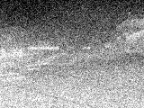
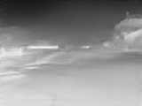
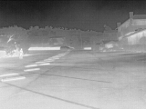

# Practical Deep Raw Image Denoising on Mobile Devices
The denoisers repo is [here](https://github.com/MeridianInnovation/Denoisers/blob/main/README.md). `The repo contains the information about all the models.`

We use .ipynb in colab to perform computation (inference and occasionally training). All the classes, functions and testing are implemented in .py files in this github repo.

## Content
  - [Preparation](#preparation)
  - [Training](#training)
  - [Inference](#inference-and-result)
  - [Improvement](#improvement)
  - [References](#references)

## Preparation
### Install
In a virtual environment, install all the necessary packages and libraries by running pip install -r requirements.txt at the root directory

### Model
`The difference with the original PMRID is to use three encoders and decoders because of smaller resolution ?`

`Compared with the original PMRID model design, we delete encoder stage 4 because it is the deepest. Then we delete decoder stage 1 because of corresponding skip connection.` 

More information can be found at [here](https://github.com/MeridianInnovation/Denoisers).

### Project Architecture
The project has two versions. One is the model developed in tensorflow (.py files). Another is the model developed in pytorch (*_torch.py files). As of today (2024-10-28), the pytorch model is more well-developed. The general structure is below:

```
├── checkpoints # Directory for saving model checkpoints
├── configs # Configuration files for hyperparameters
├── data # Pre-processed dataset
├── logs # Logs for hyperparameter changes
├── models # Pre-trained and trained models
├── src # Source code
│ ├── data # Data loading and preprocessing scripts
│ ├── model # Model architecture
│ ├── train # Training scripts
│ └── utils # Utility functions
└── tests # test cases
```


### Dataset
We use FLIR dataset and find it [here](https://drive.google.com/file/d/1XFL-vH2puregx8_ApuYVxDrQLzHE9RTQ/view?usp=drive_link). The trainning set has around 110,000 pairs of images (70%). The validation set has around 11,000 pairs of images (7%). The testing set has around 37,000 pairs of images (23%). You can use a reducer script [here](https://github.com/danielliu-meridian/image-processing/blob/main/scripts/image_dataset_reducer.py) to reduce the size of dataset by 2, 4 or 8. You can find a dataset with reducer size 8 [here](https://drive.google.com/file/d/1kWvuOn_u4gQKIUjpKU4fzdPZWWEntJzH/view?usp=sharing).

### Initial normalization
Before the model takes in the input image, we use pytorch's transform to convert the image into tensor. We also convert the data range from (0, 255) into (0, 1). We do this becuase we want better convergence. So after the training, when model returns the output, `please remember to rescale the data back to (0, 255) before output the image`

## Training
There are two ways to train the model. One is locally, another is colab.

- Load pre-processed dataset from [drive](https://drive.google.com/file/d/1kWvuOn_u4gQKIUjpKU4fzdPZWWEntJzH/view).

- At project root, run [train_torch.py](/src/train/train_torch.py) like below to train model. You can change hyperparameters by creating a new file in [configs](/configs/) and changing the argument of the Hyperparameters object in lines 246 of the training script.
```
python -m src.train.train_torch
```

## Improvement

### Learning rate Scheduler
We use cosine scheduler for the project. The scheduler is used for CV mainly. The implementation is [here](src/utils/scheduler_torch.py).

### Loss function
Thanks to Takao, according to the [article](https://research.nvidia.com/sites/default/files/pubs/2017-03_Loss-Functions-for/NN_ImgProc.pdf), `the mix` is better and will generate a `slightly higer psnr and ssim`. The paper claims it will do a better job to preserve edges as well. So we will implement the mix [here](). More details can be found at [Denoisers](https://github.com/MeridianInnovation/Denoisers).

### Hyperameters
The batch size is `32` or 64. The optimizer is `Adam`. The learning rate is `1e-2`.

#### Learning rate
For learning rate, based on our experiments, when reaching convergence, it is too slow to converge if lr is 1e-5. It is OK to have a constant learing rate as 1e-3 (a little bit slow but OK), but it will converge after epoch 8. 

#### Optimizer
For optimizer, Adam is better than SGD without any momentum. If Adam fails to converge, we should try Yogi.

#### Batch Size
 `We will choose batch size as 32.` According to [article](https://wandb.ai/ayush-thakur/dl-question-bank/reports/What-s-the-Optimal-Batch-Size-to-Train-a-Neural-Network---VmlldzoyMDkyNDU), when increase the batch size, the time taken will decrease but the error rate will increase. In our [experiment](images/batch_size_experiment/) for one epoch, the time taken for batch size 64 is 20:52, the time for 32 is 21:27, so no much difference.

### Larger Datasize & Data Augmentation
Can we reduce our losses during training by introducing a larger datasize ?
If we have that, is data augmentation nessary ? 

### Parameter Initialization

### Batch Normalization

### Early Stopping Rule

## Inference and Result
The images are (120, 160). The experiment results are below:

1. The result below in colab was acquired after training 10 epoch, the metrics are `28.68 psnr`, `0.8179 ssim`, the val `l1 loss` is `0.02518`, almost converge when we reach 9 epochs. The example images from inference are [here](images/model_2024-10-29). Run on [](https://colab.research.google.com/drive/1MJnoV_RLyxyodpH9mvuWu7paNOIbbbd9?usp=sharing)

| **Image Degraded** | **Image Restored** | **Image Original** |
|:-----------:|:-----------:|:-----------:|
|  |  |  |

## References
[1] [Practical Deep Raw Image Denoising on Mobile Devices - Paper](https://www.ecva.net/papers/eccv_2020/papers_ECCV/papers/123510001.pdf).

[2] [Loss Functions for Image Restoration with Neural Networks - Loss](https://research.nvidia.com/sites/default/files/pubs/2017-03_Loss-Functions-for/NN_ImgProc.pdf)

[3] [FLIR Kaggle - Dataset](https://www.kaggle.com/datasets/deepnewbie/flir-thermal-images-dataset)
